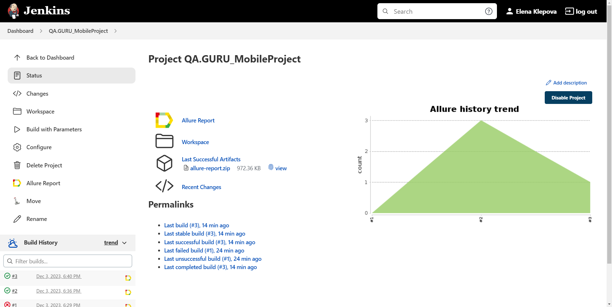

# Проект по автоматизации приложения Wikipedia
## Содержание:

- [Использованный стек технологий](#computer-использованный-стек-технологий)
- [Запуск автотестов](#arrow_forward-запуск-автотестов)
- [Сборка в Jenkins](#jenkins)
- [Пример Allure-отчета](#allure)
- <a href="#movie">Видеопример прохождения тестов Browserstack</a>

## :computer: Использованный стек технологий

<p align="center">


</p>

## :arrow_forward: Запуск автотестов

### Запуск тестов на локальном эмуляторе
```
gradle clean emulation_test -DdeviceHost=emulation
```
### Запуск тестов на удаленном устройстве через Browserstack
```
gradle clean ios_test -DdeviceHost=ios
gradle clean android_test -DdeviceHost=android
```
При выполнении команды, тесты запустятся удаленно в <code>Browserstack</code>.

##  <a href="https://jenkins.autotests.cloud/job/QA.GURU_MobileProject" target="blank">Сборка в Jenkins</a>

<p align="center">

</p>

### Параметры сборки

* <code>PLATFORM</code> – мобильная платформа, на которой выполняются тесты. По-умолчанию - <code>android</code>.

##  <a href="https://jenkins.autotests.cloud/job/QA.GURU_MobileProject/2/allure/" target="_blank">Пример Allure-отчета</a>

Содержание Allure-отчета:
* Шаги теста;
* Page Source;
* Видео выполнения автотеста.

### Overview

<p align="center">

</p>

### Результат выполнения теста

<p align="center">

</p>

<a id="movie"></a>
## </a> Видеопример выполнения теста Browserstack

<p align="center">
   
</p>